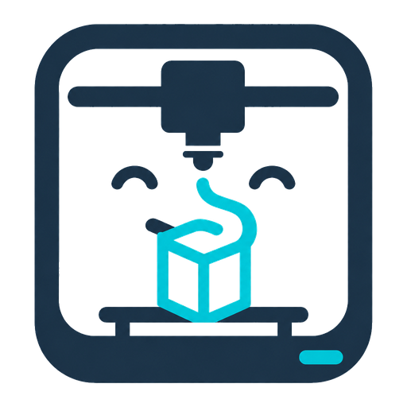

# Printbuddy Home Assistant Integration

<p align="center">
  
</p>

Custom Home Assistant integration for [Printbuddy](https://github.com/vmhomelab/Printbuddy).

It connects to a Printbuddy instance and exposes every configured Printbuddy printer as its own Home Assistant device with status, temperature, progress, fan, network, and print-job sensors.

## Features

- UI config flow; no YAML required.
- One Home Assistant device per Printbuddy printer.
- Discovers printers from `GET /api/v1/printers/`.
- Polls each printer via `GET /api/v1/printers/{id}/status`.
- Supports unauthenticated Printbuddy instances and Bearer/API-token protected instances.
- Creates stable entity unique IDs from the Printbuddy instance URL and printer ID.

## Entities

For each printer the integration can create:

- Connection binary sensor
- Door open binary sensor
- Chamber light binary sensor
- Printing status sensor
- Current print sensor
- Nozzle temperature sensor
- Nozzle target temperature sensor
- Bed temperature sensor
- Bed target temperature sensor
- Chamber temperature sensor, when reported
- Print progress sensor
- Remaining time sensor
- Current layer sensor
- Total layers sensor
- Wi-Fi signal sensor
- Fan speed sensors for part cooling, auxiliary, chamber/exhaust, and heatbreak fans, when reported

## Installation

### HACS custom repository

1. In HACS, add this repository as a custom repository of type `Integration`.
2. Install **Printbuddy**.
3. Restart Home Assistant.
4. Go to **Settings → Devices & services → Add integration → Printbuddy**.

### Manual

Copy `custom_components/printbuddy` into your Home Assistant `custom_components` directory, restart Home Assistant, then add the integration from the UI.

## Configuration

The setup flow asks for:

- **Printbuddy URL**: for example `http://10.17.200.5:8000` or the add-on URL if reachable from Home Assistant.
- **API token**: optional. If Printbuddy authentication is enabled, provide a token accepted by Printbuddy's API as a Bearer token.
- **Scan interval**: polling interval in seconds. Default: 30 seconds.

## Notes

This integration is read-only in the first version. It intentionally does not expose printer control buttons yet. That keeps the initial release safe and focused on reliable telemetry.

## Development

```bash
python -m pip install -r requirements-dev.txt
ruff check custom_components tests
pytest
```
